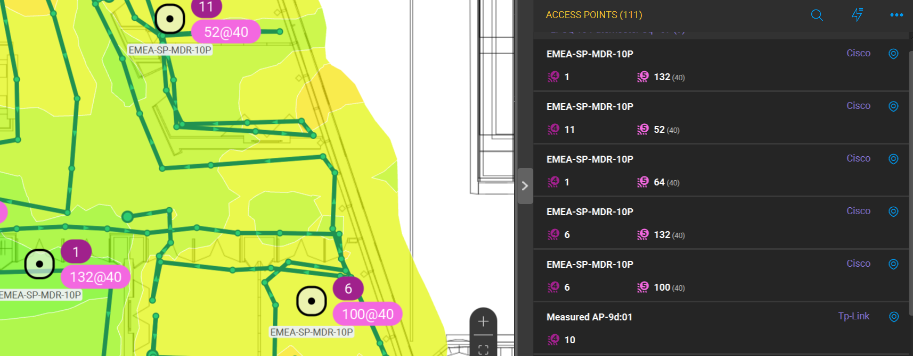
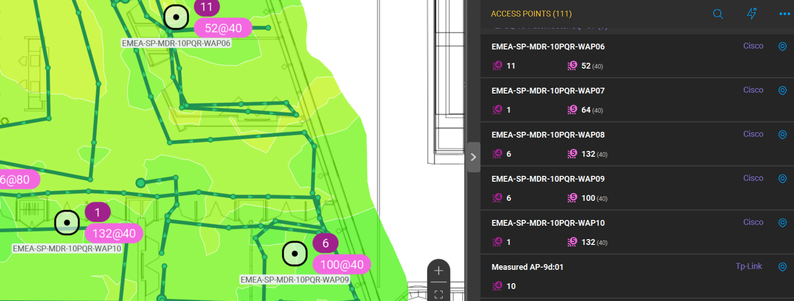

# ekahau-cisco-ap-gui
GUI wrapper for adding AP names to Ekahau site survey project file

Have you ever tried to analyze the RF site survey data from Ekahau survey project and find out that access points have no names?

There are two possible reasons:
* Special feature for broadcasting AP names in 802.11 beacon frames should be enabled (Cisco Aironet IE)
* Even when this feature is enabled, it broadcasts only 15 symbols. That is why AP that has the perfect self-describing name **"US-Alabama-Office-3-Floor-5-Room-335-right-corner-just-above-your-head"** will become featureless **"US-Alabama-Offi"**

Luckily if you have Cisco WLAN equipment and can collect WLC config file, you can solve this problem with help of this tool.

If you are Python guru and prefer to use source code, please go to special repository:
https://github.com/consulttelecom/ekahau-cisco-ap-name

## AP name adder for Ekahau project files

Small ready-to-use tool to add the names of access points into the Ekahau survey project file.
Cisco WLC config file is used as the source of data about AP names.

Example of project data before using this tool (all AP names are the same due to 15 symbols limit):

After using this tool (the project file is enriched with data from WLC config and all AP names are fulfilled)   :

***How to use the tool:***

Watch the video below to get the idea of using the tool:

https://github.com/consulttelecom/ekahau-cisco-ap-gui/assets/10699312/ba9c3f06-1a1b-4b5f-b536-e9780ecee6df

In order to use the tool, please follow these steps:

* Download archive, unzip it and start the executable file corresponding to your OS (MacOS or Windows compatible)
* Click "Browse 1" button and choose Ekahau project file
* Click "Browse 2" button and choose WLC config file
* Click "Process files" button, check the folder when the resulting file is saved
* PROFIT!

## Compatible with data from these Cisco wireless controllers:
* Cisco AireOS WLC (collect the output of **show running-config** command)
* Cisco 9800 WLC (collect the output of **show tech-support wireless** command)

## Tested with:

* Ekahau PRO 10
* Ekahau AI PRO 11

### How to get in touch for support\questions\ideas etc.
Collaboration via github tools is the preferred way, so open the issue, make pull request, fork, star etc.
Please add the following data to your issues:
* log file written during the issue (Ekahau.log from root folder)
* describe your environment (PC, OS version, Python version, libraries version)
